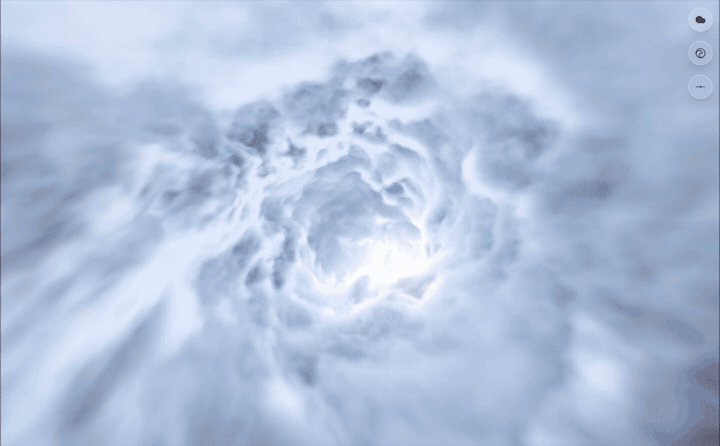

<p align="center">
  
</p>

<h1 align="center">Vibe Coding</h1>

<p align="center">
  A first-person flight through volumetric clouds and ocean waves,<br>
  rendered in real time and scored to an original soundtrack.
</p>

<p align="center">
  <a href="https://neovand.github.io/vibe-coding/"><strong>Live demo</strong></a>
</p>

---

You are inside a tunnel that never ends. The walls are either soft, sunlit cloud or a spinning funnel of water — both raymarched on the GPU, both reacting to music. A small cluster of glass-like controls floats in the corner and stays out of the way until you want it.

The soundtrack is an original piece written for this project. Frequency bands and beats drive the shaders, so lightning, density, and motion stay locked to the music.

## Two worlds

**Clouds** — volumetric fog with multiple noise patterns, a sun you fly toward, and optional lightning that can fire on the beat.

| Preset | Mood |
| --- | --- |
| Dreamy | Pale blues, slow vortex, open sky |
| Sunset | Warm haze and veiny organic cells |
| Storm | Dark ridged billows, audio-synced lightning |
| Moonlight | Liquid night clouds and a cold core |

**Water** — a Shadertoy-style ocean vortex: rolling swell, fresnel highlights, depth fog, and a camera that drifts with the current.

| Preset | Mood |
| --- | --- |
| Maelstrom | Classic deep-water funnel |
| Siren | Teal lobes and sea-glass shimmer |
| Lagoon | Tight, choppy cyan ripples |
| Arctic | Slow, glassy ice-mist |

Switch worlds from the floating theme bubbles. Hover (or tap) to fan out presets; open the panel for camera, tunnel, lighting, and performance.

## Music

Playback starts automatically when the browser allows it. The analyser splits the mix into bass, mid, high, and a decaying beat trigger, which the shaders read every frame.

Mute, unmute, and volume live on the same control cluster. Storm mode can flash lightning from the beat instead of at random.

## Run locally

A recent Chromium or Safari build with hardware GPU acceleration works best.

```bash
npm install
npm run dev
```

Then open the URL Vite prints (usually `http://localhost:5173`).

```bash
npm run build    # static site → dist/
npm run preview  # serve the production build
```

The production build is configured for GitHub Pages at `/vibe-coding`.

## Stack

- [SvelteKit](https://svelte.dev/) + [Svelte 5](https://svelte.dev/docs/svelte/overview)
- [Three.js](https://threejs.org/) fullscreen GLSL shaders (raymarching, FBM noise, LOD)
- Web Audio API for beat and spectrum analysis
- [Tailwind CSS](https://tailwindcss.com/) for the overlay UI
